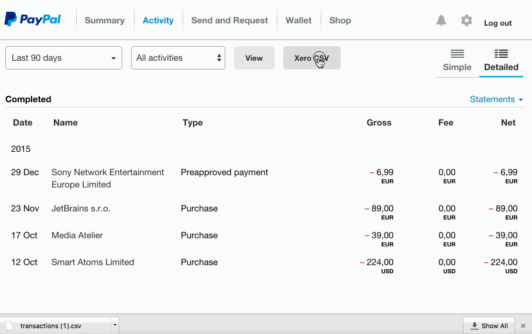

# READ ME

A chrome extension adding a new button to PayPal's Activity view, allowing you to download
all information required by Xero with a single click.

## Particularities

* Fixes the currency representation, replacing ',' with '.' for decimals, dropping the currency. 
* Rewrites the date format to 'DD/MM/YY' – which is what Xero expects. 
* Uses your *own* currency instead of the currency of the supplier.
* Includes a reference to your bank account. If you are like me, and you have PayPal backed by a numer of credit cards and bank accounts, then this might be useful to you. In fact, it would be nice if the extension would actually allow you to filter. That will have to wait for a while though.

## Limitations

* It doesn't handle situations correctly where the amount of a transaction is *sourced* from different backing accounts. Not sure how to handle those cases correctly. Perhaps a transaction for every individual amount sourced to eventually make up for all money required for a payment?
